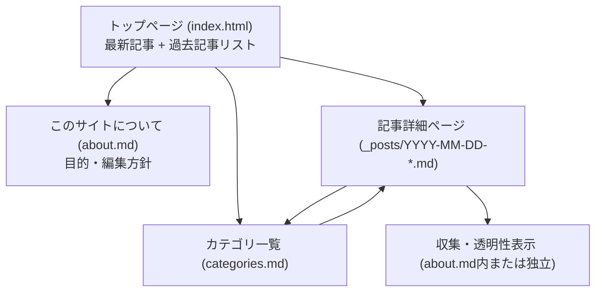
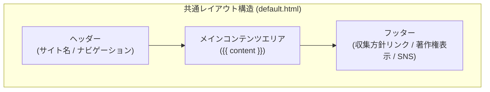
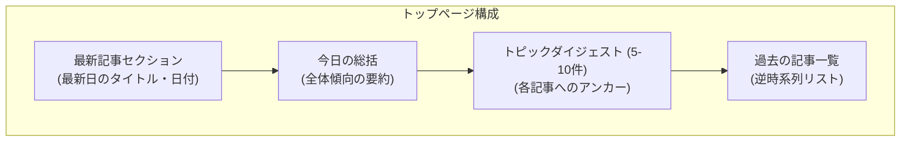
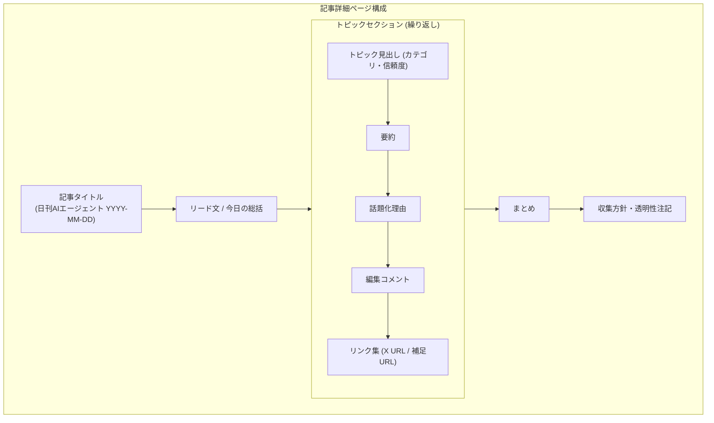

# UI.md - サイト構成・レイアウト設計
Version: 0.1
作成: 2026-03-12

---

## 1. サイト構成図 (Site Map)

サイト全体のページ遷移と階層構造を示します。

---

## 2. 共通レイアウト (Global Layout)

すべてのページに適用される基本レイアウト構成です。

### 構成要素
- **Header**: 
  - サイトロゴ/タイトル（「日刊AIエージェント」）
  - メインナビゲーション（Home, Categories, About）
- **Footer**:
  - 著作権表示 (© 2026 daily-ai-agent)
  - 収集・編集方針へのクイックリンク
  - 免責事項へのリンク
  - SNS（X等）へのリンク：情報共有用（サイト内コメント機能の代替）

---

## 3. ページ別詳細レイアウト

### 3.1 トップページ (Top Page Layout)

最新の記事をメインに据え、過去記事へのアクセスを提供します。**トップページはダイジェスト（要約・リンク）を中心とし、詳細は個別記事ページへ誘導する構成とする。**

### 3.2 記事ページ (Article Page Layout)

個別のニュース項目を構造化して表示します。**当日の全トピックについて、詳細情報（理由、コメント、リンク等）を網羅する。**

---

## 4. UIコンポーネント仕様

### 4.1 トピックカード (Topic Card)
各ニュース項目の表示ユニットです。

- **タグ**: カテゴリ (Claude Code, Devin等) を色分け表示
- **信頼度表示**: 星数またはテキスト（例: High, Medium, Low）
- **アクション**: 「元投稿を見る (X)」ボタン

### 4.2 ナビゲーションバー
- モバイル表示時はハンバーガーメニューに折り畳まれるレスポンシブ対応（Phase 2以降）
- アクティブなページを強調表示

---

## 5. デザイン方針 (Visual Style)

- **テーマ**: シンプル、清潔、技術専門誌風
- **フォント**: 日本語はゴシック体、英数字は等幅フォント（Monospace）を適宜使用
- **配色**: 
  - ベース: 白・オフホワイト
  - テキスト: 濃いグレー
  - アクセント: AIを想起させる青や紫、またはコーディングエージェント風の緑
- **レイアウト**: 読みやすさを重視した1カラム中心の構成（最大幅を制限）
